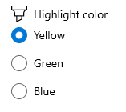

# Microsoft.UI.Xaml.Controls.RadioButtons.Header

<!--
public object Header { get; set; }
-->

## -description

Gets or sets the content for the group header.

## -property-value

The content of the group header. The default is `null`.

## -remarks

> For more info, design guidance, and code examples, see [Radio buttons](/windows/apps/design/controls/radio-button).

You typically use a string for the header, which is displayed as a text label above the radio buttons group. Other objects can also be used instead of a string.

You can set a data template for the header by using the [HeaderTemplate](radiobuttons_headertemplate.md) property. If the `HeaderTemplate` property is set, it is used for the header and the `Header` property is ignored.

## -see-also

[RadioButtons](radiobuttons.md), [HeaderTemplate](radiobuttons_headertemplate.md)

## -examples

This example shows a `RadioButtons` group with its `Header` set to "Background color".

```xaml
<!-- xmlns:muxc="using:Microsoft.UI.Xaml.Controls -->
<muxc:RadioButtons Header="Background color">
    <x:String>Red</x:String>
    <x:String>Green</x:String>
    <x:String>Blue</x:String>
</muxc:RadioButtons>
```


This example shows a `RadioButtons` group with it a complex header with an icon and text.

```xaml
<!-- xmlns:muxc="using:Microsoft.UI.Xaml.Controls -->
<muxc:RadioButtons>
    <muxc:RadioButtons.Header>
        <StackPanel Orientation="Horizontal">
            <SymbolIcon Symbol="Highlight"/>
            <TextBlock Text="Highlight color" Margin="8,0,0,0"/>
        </StackPanel>
    </muxc:RadioButtons.Header>
    <x:String>Yellow</x:String>
    <x:String>Green</x:String>
    <x:String>Pink</x:String>
</muxc:RadioButtons>
```


