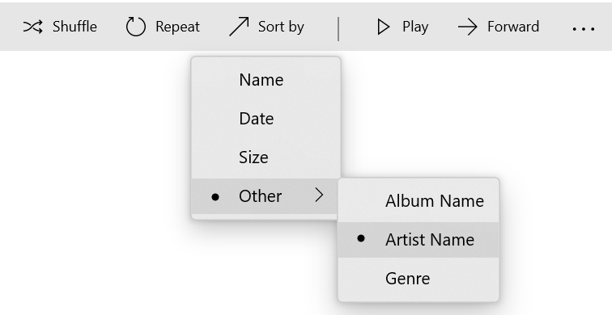

# Microsoft.UI.Xaml.Controls.RadioMenuFlyoutItem.AreCheckStatesEnabledProperty

<!--
public static Windows.UI.Xaml.DependencyProperty AreCheckStatesEnabledProperty { get; }
-->


## -description

Identifies the [AreCheckStatesEnabled](radiomenuflyoutitem_arecheckstatesenabled.md) dependency property.
Represents whether the [MenuFlyoutSubItem](menuflyoutsubitem.md) has RadioMenuFlyoutItems as children.

## -property-value

The identifier for the [AreCheckStatesEnabled](radiomenuflyoutitem_arecheckstatesenabled.md) dependency property.

## -remarks
This property should only be used in conjunction with a MenuFlyoutSubItem that has the `RadioMenuFlyoutSubItemStyle` applied to it. Since the `RadioMenuFlyoutSubItemStyle` automatically sets this property to true, this property will not need to be set manually.

When using [RadioMenuFlyoutItem](radiomenuflyoutitem.md) objects as children of a MenuFlyoutSubItem, you should set the MenuFlyoutSubItem style to `RadioMenuFlyoutSubItemStyle`. This will set `AreCheckStatesEnabled` to true and ensure that when any of its child RadioMenuFlyoutItems are selected, the MenuFlyoutSubItem will also display a visual check indicator.

If a RadioMenuFlyoutItem child is selected and the MenuFlyout is open, both the parent and child will show the selection indicator.

## -see-also
[MenuFlyoutSubItem](menuflyoutsubitem.md)

## -examples
In the following example, a CommandBar has a "Sort By" button which lists out sorting options in a MenuFlyout. This MenuFlyout has an "Other" sub menu containing RadioMenuFlyoutItems. When one of those items is selected, the "Other" sub menu shows the selection visual as well.

```xml
<CommandBar DefaultLabelPosition="Right" Grid.Row="1" Margin="50">
    <AppBarToggleButton Icon="Shuffle" Label="Shuffle" />
    <AppBarToggleButton Icon="RepeatAll" Label="Repeat" />
    <AppBarSeparator/>
    <AppBarButton Icon="Back" />
    <AppBarButton Icon="Stop" />
    <AppBarButton Icon="Go" Label="Sort by">
        <AppBarButton.Flyout>
            <MenuFlyout>
                <RadioMenuFlyoutItem Text="Name" GroupName="SortGroup"/>
                <RadioMenuFlyoutItem Text="Date" GroupName="SortGroup"/>
                <RadioMenuFlyoutItem Text="Size" GroupName="SortGroup"/>
                <MenuFlyoutSubItem Text="Other" Style="{StaticResource RadioMenuFlyoutSubItemStyle}">
                    <RadioMenuFlyoutItem GroupName="SortGroup" Text="Album Name"/>
                    <RadioMenuFlyoutItem GroupName="SortGroup" Text="Artist Name"/>
                    <RadioMenuFlyoutItem GroupName="SortGroup" Text="Genre"/>
                </MenuFlyoutSubItem>
            </MenuFlyout>
        </AppBarButton.Flyout>
    </AppBarButton>

    <AppBarSeparator/>
    <AppBarButton Icon="Play" Label="Play" />
    <AppBarButton Icon="Forward" Label="Forward" />

    <CommandBar.SecondaryCommands>
        <AppBarButton Label="Like" />
        <AppBarButton Label="Dislike" />
    </CommandBar.SecondaryCommands>

</CommandBar>
```



