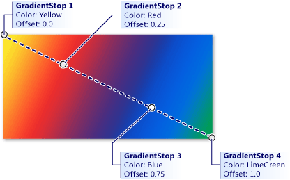

<!-- Class syntax.
public class GradientStop : Windows.UI.Xaml.DependencyObject, Windows.UI.Xaml.Media.IGradientStop
-->

# Microsoft.UI.Xaml.Media.GradientStop

## -description
Describes the location and color of a transition point in a gradient.

**This documentation applies to WinUI 2 for UWP** (for [WinUI](/windows/apps/winui/winui3/) in the [Windows App SDK](/windows/apps/windows-app-sdk/), see the **[Windows App SDK namespaces](/windows/windows-app-sdk/api/winrt/)**).

## -xaml-syntax
```xaml
<GradientStop .../>
```


## -remarks

## -examples
This example creates a linear gradient with four colors and uses it to paint a [Rectangle](../microsoft.ui.xaml.shapes/rectangle.md).


[!code-xaml[Gradient1](../microsoft.ui.xaml.media/code/Gradients/csharp/Page.xaml#SnippetGradient1)]



## -see-also
[DependencyObject](../microsoft.ui.xaml/dependencyobject.md)
dencyObject](../windows.ui.xaml/dependencyobject.md)
